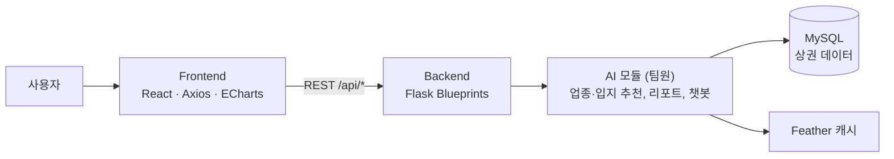

# KSEB_Proj — 서울 상권 데이터 기반 창업 업종 · 입지 추천 웹 서비스

> 예비 창업자가 **지역을 고르면 유망 업종을, 업종을 고르면 유망 지역(동)을** 추천받고, 매출·인구·점포 지표를 차트 리포트와 AI 상담으로 확인할 수 있는 웹 서비스입니다.


| 항목 | 내용 |
|---|---|
| 기간 | 2025.06 ~ 2025.08 |
| 유형 | 교내 부트캠프 (팀 프로젝트) |
| 팀 구성 | 4명 |
| 내 역할 | **팀장 · 풀스택 (Frontend + Backend 전담)** |

---

## 핵심 기능

1. **업종 추천**: 자치구와 동을 선택하면 추천 업종 목록과 추천 이유를 제공
2. **입지 추천**: 업종과 자치구를 선택하면 추천 동 목록을 제공
3. **상권 리포트**: 연령·성별 매출, 지역 요약 지표를 ECharts 차트로 시각화
4. **AI 상담**: 상권 관련 질문에 답하는 챗봇

<!-- 스크린샷 자리: 홈(지역/업종 선택) / 추천 결과 / 리포트 차트 / 챗봇 -->

---

## 아키텍처



- **API를 Flask Blueprint로 기능별로 나눴습니다.** 업종 추천, 입지 추천, 리포트, 챗봇을 각각 독립 라우트로 등록하고 `/api` 아래에 묶었습니다.
- **설정은 환경변수로 주입합니다.** DB 접속 정보와 CORS 허용 도메인을 `.env`에서 읽습니다.

### API

| Method | Path | 설명 |
|---|---|---|
| POST | `/api/recommend/industry` | 지역 → 업종 추천 |
| POST | `/api/recommend/area` | 업종 → 지역 추천 |
| GET / POST | `/api/report` | 상권 리포트 데이터 |
| POST | `/api/chat` | AI 상담 |
| GET | `/health` | 헬스 체크 |

---

## 기술 스택

| 영역 | 기술 |
|---|---|
| Frontend | React (CRA), React Router, Axios, ECharts, react-select |
| Backend | Python, Flask, Flask-CORS, SQLAlchemy |
| DB | MySQL |
| AI (팀원) | pandas, scikit-learn, Gemini API, LangChain + FAISS |

---

## 내가 맡은 일

**나 (팀장 · 풀스택)**
- React 화면 전체: 지역·업종 선택 홈, 업종/입지 추천 결과, 리포트 페이지
- ECharts로 매출·인구 지표 차트 구현, Axios로 API 연동
- Flask 백엔드: Blueprint 기반 API 4종, CORS·공통 에러 처리, 헬스 체크
- 프론트–백–AI 모듈 통합과 저장소 관리

**팀원**
- 업종·입지 추천 알고리즘, 추천 이유 생성, 상권 리포트 생성
- RAG 기반 상담 챗봇

---

## 실행 방법

```bash
git clone https://github.com/alberione1110/KSEB_Proj.git
cd KSEB_Proj

# 1) 백엔드
cd back
python -m venv venv
venv\Scripts\activate          # macOS/Linux: source venv/bin/activate
pip install -r requirements.txt
copy .env.example .env         # macOS/Linux: cp .env.example .env  → DB 접속 정보 입력
python app.py

# 2) 프론트엔드 (새 터미널)
cd front
npm install
npm start                      # http://localhost:3000
```

- 상권 데이터가 들어 있는 MySQL DB가 필요합니다. DB 덤프는 저장소에 포함하지 않았습니다.
- AI 기능을 쓰려면 Gemini · OpenAI API 키를 환경변수로 설정해야 합니다.

---

## 폴더 구조

```text
KSEB_Proj/
├─ front/            # React (pages: Home, RecommendIndustry, RecommendArea, Report)
├─ back/
│  ├─ app.py         # Flask 앱, Blueprint 등록
│  ├─ routes/        # recommendIndustry, recommendArea, report, chat
│  └─ config/        # 환경변수 기반 DB 설정
└─ ai/               # 추천·리포트·챗봇 모듈 (팀원)
```
